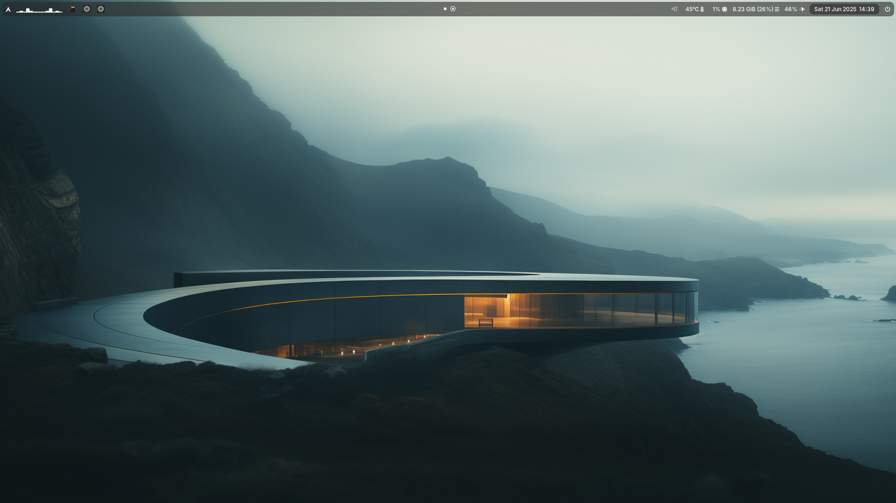
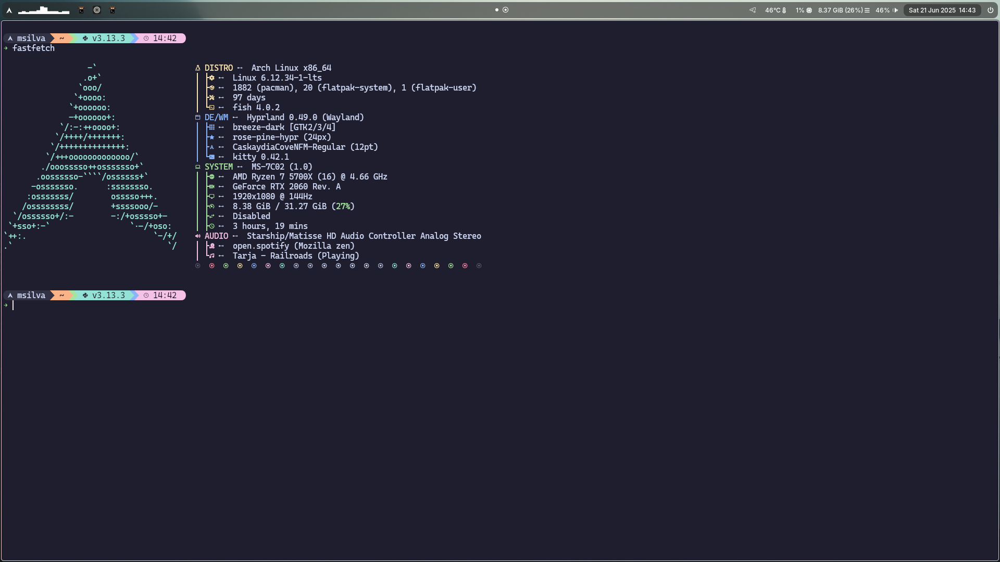
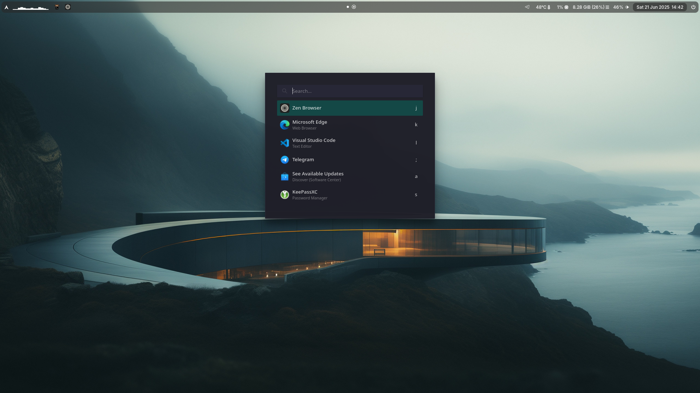
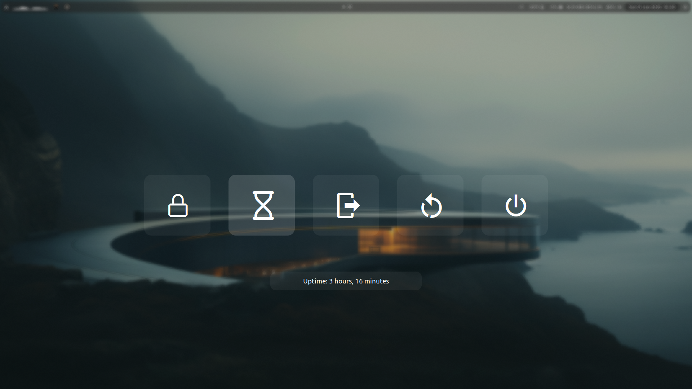

# Linux Config

My linux configuration files.

- [Niri](https://github.com/YaLTeR/niri)
- [Hyprland](https://hyprland.org/)
- [Noctalia](https://github.com/noctalia-dev/noctalia-shell)
- [NeoVim](https://neovim.io/)
- [Fish](https://fishshell.com/)
- [Hyprlock](https://github.com/hyprwm/hyprlock/)
- [MPV](https://github.com/mpv-player/mpv)

Terminal i'm using:

- [Alacritty](https://alacritty.org/)
- [Ghostty](https://ghostty.org/)
- [Kitty](https://sw.kovidgoyal.net/kitty/)

## How it looks

 
 

 

## Keybinds

`Super+Enter` - Open Terminal

`Super+Space` - Open App Launcher

`Super+M` - Menu Quit, Restart, Suspend,...
 
`Super+Q` - Close

`Super+F` - Fullscreen

`Super+V` - Popout

`Super+W` - Random Wallpaper

`Super+Z` - Zen Browser

`Super+E` - Thunar file manager
