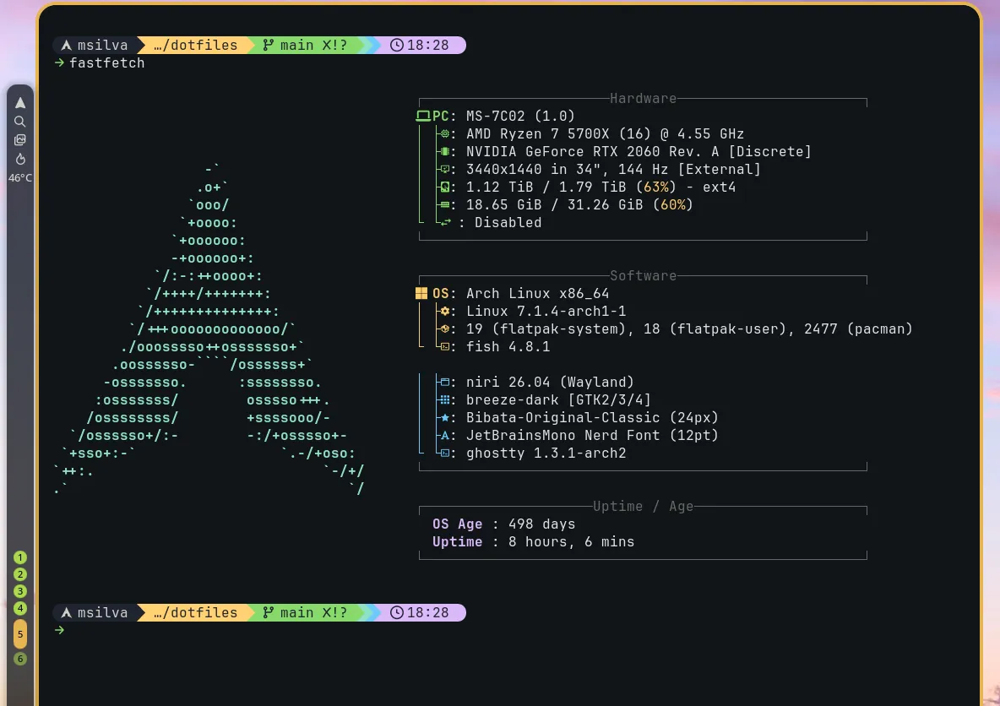
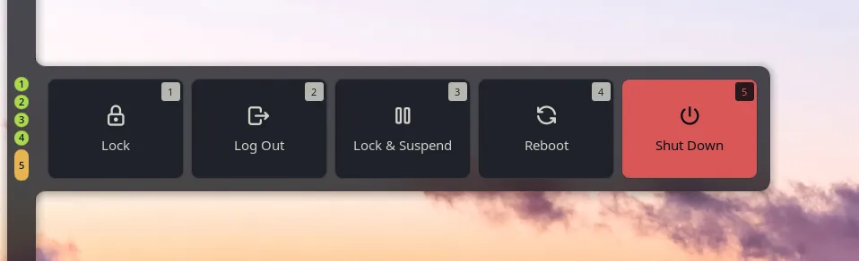
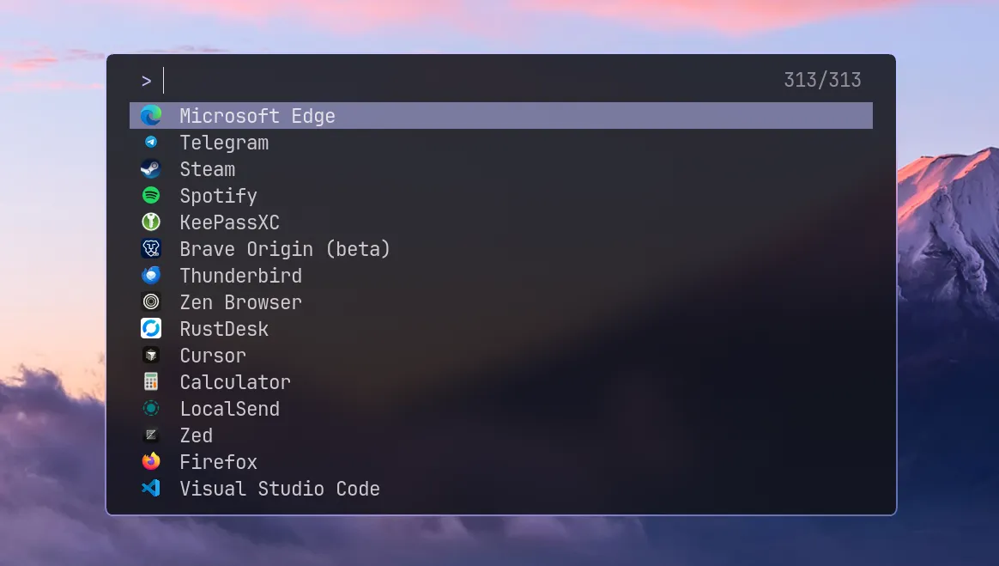

# Linux Config

My Linux configuration files. Daily-driver stack: **Hyprland** + **Niri** + **Noctalia v5**.

## Compositors

- [Hyprland](https://hyprland.org/) — primary, configured in Lua (Hyprland 0.55+ `hl.*` API)
- [Niri](https://github.com/YaLTeR/niri) — scrollable-tiling compositor, kept in sync

Both share the same keybind scheme and the same Noctalia shell.

## Shell / UI

- [Noctalia v5](https://github.com/noctalia-dev/noctalia-shell) — bar, launcher, control center, settings, session menu, lockscreen, wallpaper pipeline
- [SwayNC](https://github.com/ErikReider/SwayNotificationCenter) — notifications
- [Hypridle](https://github.com/hyprwm/hypridle) — idle daemon
- [Fuzzel](https://codeberg.org/dnkl/fuzzel) — fallback launcher (SUPER+\`)
- [Wofi](https://hg.sr.ht/~scoopta/wofi) — legacy launcher retained only for a single keybind (SUPER+R) and a rofi powermenu fallback (SUPER+M)
- [Thunar](https://docs.xfce.org/xfce/thunar/start) — file manager

## Terminal

- [Ghostty](https://ghostty.org/) — default (SUPER+Return)
- [Alacritty](https://alacritty.org/) — SUPER+T
- [Kitty](https://sw.kovidgoyal.net/kitty/) — also configured

## Editor

- [Neovim](https://neovim.io/) — Lazy.nvim + modular plugin specs in `.config/nvim/lua/plugins/`

## Multimedia / shell

- [Starship](https://starship.rs/) — prompt
- [Fish](https://fishshell.com/) — shell
- [MPV](https://github.com/mpv-player/mpv) — video

## How it looks






## Repo layout

```
.config/
├── alacritty/
│   ├── alacritty.toml
│   └── themes/
│       └── noctalia.toml
├── backgrounds/
├── fish/
│   ├── config.fish
│   └── fish_variables
├── ghostty/
│   └── config
├── hypr/
│   ├── hyprland.lua                  # entrypoint (Lua)
│   ├── hyprlock.conf
│   ├── hypridle.conf
│   └── hyprconf/
│       ├── autostart.lua
│       ├── colors.lua
│       ├── env.lua
│       ├── inputs.lua
│       ├── keybinds.lua              # base binds (multimedia via wpctl/playerctl)
│       ├── keybinds-noctalia.lua     # Noctalia IPC binds + workspace rules
│       ├── layers.lua
│       ├── look.lua
│       ├── monitors.lua
│       └── windowrules.lua
├── kitty/
│   ├── kitty.conf
│   └── themes/
│       └── noctalia.conf
├── mpv/
│   └── mpv.conf
├── niri/
│   ├── config.kdl
│   └── noctalia.kdl                  # Noctalia theme overrides for Niri
├── nvim/
│   ├── init.lua
│   └── lua/
│       ├── matugen.lua
│       ├── plugins.lua
│       ├── vim-options.lua
│       └── plugins/
│           ├── avante.lua
│           ├── catppuccin.lua
│           ├── completions.lua
│           ├── dankcolors.lua
│           ├── lsp-config.lua
│           ├── none-ls.lua
│           ├── nvim-tmux-navigation.lua
│           ├── oil.lua
│           ├── rails.lua
│           ├── snacks.lua
│           ├── swagger-preview.lua
│           ├── treesitter.lua
│           └── vim-test.lua
└── starship.toml
```

## Notes

- **Hyprland is Lua everywhere.** Legacy `.conf` files were removed; the `hyprconf/` modules are loaded via `require()` from `hyprland.lua`.
- **Noctalia v5 IPC** is used for: launcher, control center, settings, session menu, lockscreen, wallpaper panel, random wallpaper, volume, brightness, DPMS. Commands: `noctalia msg <command>`.
- **Base keybinds (multimedia)** still use `wpctl` / `brightnessctl` / `playerctl` directly (in `keybinds.lua`) — these are intentional duplicates of the Noctalia IPC versions in `keybinds-noctalia.lua`. The last-defined bind wins, so Noctalia IPC is the live one. Keep both until you decide which to keep.
- **`hyprlock.conf`** is present but the lockscreen goes through Noctalia (`SUPER+L` → `noctalia msg session lock`). Hyprlock is kept as a fallback config.
- **`hyprpaper.conf`** was removed — wallpaper is owned by Noctalia's pipeline.
- **Themes** in terminals are split: Ghostty uses `catppuccin-mocha` with a dynamic `config-dankcolors` mirror; Alacritty and Kitty import `themes/noctalia.conf`. Pick one or wire up the Noctalia theme script to overwrite all three.
- **Removed** (no longer used): `waybar/`, `wofi/` (the standalone config; the launcher keybind calls `wofi --show drun` but the live machine uses Noctalia), `cava/`, `caway/`, `hyprlock/` (the legacy top-level folder).
- **Personal paths** in `nvim/lua/plugins/lsp-config.lua` (e.g. `/home/typecraft/.asdf/shims/ruby-lsp`) are kept verbatim from the live machine — adjust to your own `$PATH` if you reuse this config.

## Keybinds (Hyprland)

`SUPER+Return` — Open Ghostty (terminal)
`SUPER+T` — Open Alacritty
`SUPER+grave` — Open Fuzzel (fallback launcher)

`SUPER+Space` — Noctalia launcher
`SUPER+S` — Noctalia control center
`SUPER+,` — Noctalia settings
`SUPER+X` — Noctalia session menu
`SUPER+W` — Noctalia wallpaper panel
`SUPER+Shift+W` — Random wallpaper
`SUPER+M` — Power menu (rofi)

`SUPER+Q` — Close window
`SUPER+V` — Toggle floating
`SUPER+F` — Fullscreen
`SUPER+P` — Pseudo-tile
`SUPER+J` — Toggle split (dwindle)

`SUPER+Tab` / `SUPER+Shift+Tab` — Cycle next/prev window

`SUPER+1..9, 0` — Switch workspace
`SUPER+Shift+1..9, 0` — Move window to workspace
`SUPER+U` / `SUPER+I` — Workspace prev/next
`SUPER+Shift+U` / `SUPER+Shift+I` — Move window to prev/next workspace

`SUPER+L` — Lock
`SUPER+Ctrl+S` — Lock + suspend
`SUPER+Shift+Q` — Logout
`SUPER+Shift+X` — Power off
`SUPER+Ctrl+X` — Reboot
`SUPER+Shift+P` — DPMS off
`SUPER+Ctrl+P` — DPMS on

`SUPER+Shift+R` — Reload Hyprland
`SUPER+Ctrl+E` — Exit Hyprland

`SUPER+→/←/↑/↓` — Move focus
`SUPER+Shift+→/←/↑/↓` — Move window

`SUPER+wheel` — Switch workspace
`SUPER+LMB drag` — Move window
`SUPER+RMB drag` — Resize window

`Print` — Screenshot region
`Shift+Print` — Screenshot window
`Ctrl+Print` — Screenshot screen

`XF86AudioRaiseVolume` / `XF86AudioLowerVolume` / `XF86AudioMute` / `XF86AudioMicMute` — Volume
`XF86MonBrightnessUp` / `XF86MonBrightnessDown` — Brightness
`XF86AudioPrev` / `XF86AudioNext` / `XF86AudioPlay` / `XF86AudioPause` — Media keys

## Keybinds (Niri)

Niri uses `Mod` = `SUPER`. The keybind set is more granular (focus-column-left/right, focus-window-down/up, consume-or-expel, etc.) — see `.config/niri/config.kdl` for the full list. Noctalia IPC keys mirror the Hyprland set.
